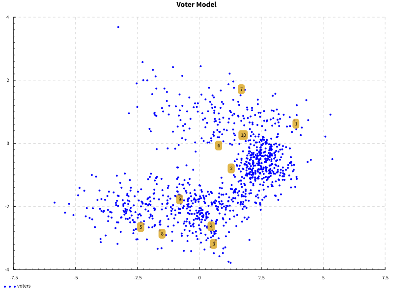

# Spatial voter modeling in Haskell

This is an implementation of a spatial Mixture-of-Zipf-Gaussians voter model in
Haskell, as well as tools for simulation different voting systems and analyzing
their results on a reasonably realistic voting population.

## Example

The following command runs a single simulation involving 10 candidates and
100,000 voters.

```bash
cabal run exe:spatial-voting -- 10 100000 1
```

A visualization will be written showing the voting populationand the candidates
on a low-dimensional projection of the voter model.  Keep in mind that the full
voter model is 100-dimensional, so this is only a rough approximation, but the
dimensions of highest variation are, in general, included here.



The output will also contain a summary of the results:

```
Utilitarian: [1,10,2,7,6,5,8,9,3,4]
```

This is a measure of which candidates voters will be happiest with, according
to the model.  It's not a voting system, but it's a useful baseline for
comparing voting systems.

```
Smith: [[2],[1],[10],[7],[5],[8],[6],[9],[3],[4]]
IRV: [10,7,6,5,2,3,1,8,9,4]
Plurality: [7,5,6,10,2,1,8,3,9,4]
Plurality tactical: [7,5,1,2,3,4,6,8,9,10]
Borda: [2,1,10,7,6,5,8,9,3,4]
Borda tactical: [2,1,10,7,5,6,8,9,3,4]
Range: [1,10,2,7,6,5,8,9,3,4]
Range tactical: [7,2,1,10,6,9,3,8,4,5]
STAR: [1,10,2,7,6,5,8,9,3,4]
STAR tactical: [2,7,1,10,6,9,3,8,4,5]
Dual IRV: [2,7,5,1,10,8,6,9,3,4]
Dual Plurality: [10,2,1,9,6,7,3,5,8,4]
```

These are various election systems, and the results of an election run by each
system on the simulated population.  For voting systems that have
straight-forward strategy for voters to maximize the effect of their ballots,
the "tactical" versions of the systems are also included assuming that they do
so.

Finally, we have some measures of similarity between the voting systems: how
often they agree on a winner, and their Spearman rank correlation for the
entire ranking of candidates from start to end.  Since we only simulated a
single election, the winner agreement matrix contains only 0s and 1s.

```
Winner Agreement:
[1.0,0.0,0.0,0.0,0.0,0.0,0.0,1.0,0.0,1.0,0.0,0.0,0.0]
[0.0,1.0,0.0,0.0,0.0,1.0,1.0,0.0,0.0,0.0,1.0,1.0,0.0]
[0.0,0.0,1.0,0.0,0.0,0.0,0.0,0.0,0.0,0.0,0.0,0.0,1.0]
[0.0,0.0,0.0,1.0,1.0,0.0,0.0,0.0,1.0,0.0,0.0,0.0,0.0]
[0.0,0.0,0.0,1.0,1.0,0.0,0.0,0.0,1.0,0.0,0.0,0.0,0.0]
[0.0,1.0,0.0,0.0,0.0,1.0,1.0,0.0,0.0,0.0,1.0,1.0,0.0]
[0.0,1.0,0.0,0.0,0.0,1.0,1.0,0.0,0.0,0.0,1.0,1.0,0.0]
[1.0,0.0,0.0,0.0,0.0,0.0,0.0,1.0,0.0,1.0,0.0,0.0,0.0]
[0.0,0.0,0.0,1.0,1.0,0.0,0.0,0.0,1.0,0.0,0.0,0.0,0.0]
[1.0,0.0,0.0,0.0,0.0,0.0,0.0,1.0,0.0,1.0,0.0,0.0,0.0]
[0.0,1.0,0.0,0.0,0.0,1.0,1.0,0.0,0.0,0.0,1.0,1.0,0.0]
[0.0,1.0,0.0,0.0,0.0,1.0,1.0,0.0,0.0,0.0,1.0,1.0,0.0]
[0.0,0.0,1.0,0.0,0.0,0.0,0.0,0.0,0.0,0.0,0.0,0.0,1.0]
```

However, the correlation matrix gives more detailed information.

```
Correlation Matrix:
[1.00,0.93,0.61,0.61,0.20,0.96,0.95,1.00,0.73,1.00,0.75,0.76,0.77]
[0.93,1.00,0.52,0.58,0.31,0.96,0.99,0.93,0.67,0.93,0.71,0.90,0.68]
[0.61,0.52,1.00,0.88,0.18,0.59,0.58,0.61,0.48,0.61,0.44,0.56,0.47]
[0.61,0.58,0.88,1.00,0.47,0.61,0.62,0.61,0.41,0.61,0.36,0.75,0.26]
[0.20,0.31,0.18,0.47,1.00,0.26,0.32,0.20,0.21,0.20,0.18,0.55,-0.19]
[0.96,0.96,0.59,0.61,0.26,1.00,0.99,0.96,0.77,0.96,0.81,0.84,0.77]
[0.95,0.99,0.58,0.62,0.32,0.99,1.00,0.95,0.71,0.95,0.75,0.89,0.73]
[1.00,0.93,0.61,0.61,0.20,0.96,0.95,1.00,0.73,1.00,0.75,0.76,0.77]
[0.73,0.67,0.48,0.41,0.21,0.77,0.71,0.73,1.00,0.73,0.99,0.58,0.73]
[1.00,0.93,0.61,0.61,0.20,0.96,0.95,1.00,0.73,1.00,0.75,0.76,0.77]
[0.75,0.71,0.44,0.36,0.18,0.81,0.75,0.75,0.99,0.75,1.00,0.59,0.78]
[0.76,0.90,0.56,0.75,0.55,0.84,0.89,0.76,0.58,0.76,0.59,1.00,0.44]
[0.77,0.68,0.47,0.26,-0.19,0.77,0.73,0.77,0.73,0.77,0.78,0.44,1.00]
```
